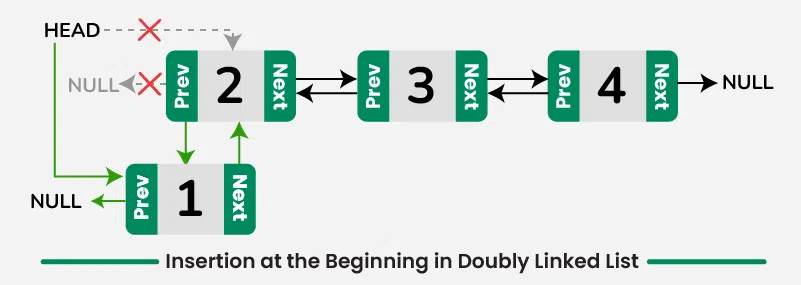
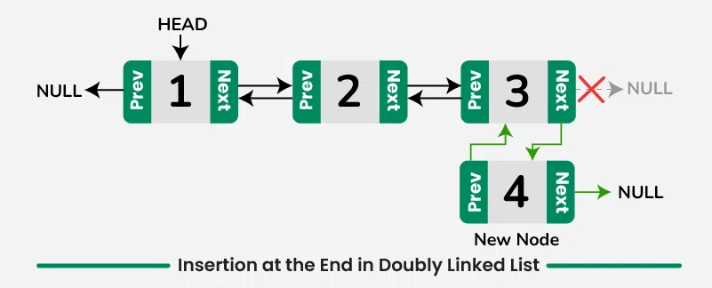
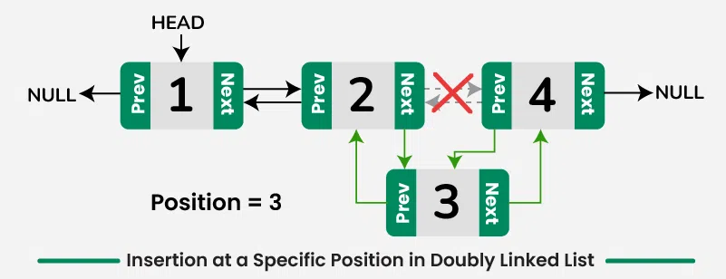

# Double Linked List

## Resource

- [Geek for Geek: double Linked List Insertion](https://www.geeksforgeeks.org/introduction-and-insertion-in-a-doubly-linked-list/)
- What is the head pointer? Is it important?
- What is the tail pointer?
---

## Code:

### Headers:
```cpp
#ifndef DOUBLELINKEDLIST_H
#define DOUBLELINKEDLIST_H

#include <iostream>

// Node class for double linked list
class Node {
public:
    int data;
    Node* next;
    Node* prev;

    Node(int val);
};

// DoubleLinkedList class
class DoubleLinkedList {
private:
    Node* head;

public:
    DoubleLinkedList();

    void insertAtBeginning(int data);
    void insertAtEnd(int data);
    void insertAtLocation(int data, int position);
    void update(int position, int newData);
    void deleteByPosition(int position);
    bool isEmpty() const;
    void clear();
    bool search(int value) const;
    void displayList();
    bool insertAfterALocation(int data, int Location);
};

#endif
```
--- 

## Double Linked List Implementation:

```cpp
// DoubleLinkedList.cpp
#include "DoubleLinkedList.h"

// Node class constructor
Node::Node(int val) : data(val), next(nullptr), prev(nullptr) {}

// DoubleLinkedList class constructor
DoubleLinkedList::DoubleLinkedList() : head(nullptr) {}

void DoubleLinkedList::insertAtBeginning(int data) {
    Node* newNode = new Node(data);
    newNode->next = head;
    if (head != nullptr) {
        head->prev = newNode;
    }
    head = newNode;
}

void DoubleLinkedList::insertAtEnd(int data) {
    Node* newNode = new Node(data);
    if (head == nullptr) {
        head = newNode;
    } else {
        Node* temp = head;
        while (temp->next != nullptr) {
            temp = temp->next;
        }
        temp->next = newNode;
        newNode->prev = temp;
    }
}

void DoubleLinkedList::insertAtLocation(int data, int position) {
    if (position <= 0) {
        std::cerr << "Invalid position\n";
        return;
    }

    Node* newNode = new Node(data);
    if (position == 1) {
        newNode->next = head;
        if (head != nullptr) {
            head->prev = newNode;
        }
        head = newNode;
    } else {
        Node* temp = head;
        for (int i = 1; temp != nullptr && i < position - 1; i++) {
            temp = temp->next;
        }

        if (temp == nullptr) {
            std::cerr << "Invalid position\n";
            return;
        }

        newNode->next = temp->next;
        newNode->prev = temp;
        if (temp->next != nullptr) {
            temp->next->prev = newNode;
        }
        temp->next = newNode;
    }
}

void DoubleLinkedList::update(int position, int newData) {
    Node* temp = head;
    for (int i = 1; temp != nullptr && i < position; i++) {
        temp = temp->next;
    }

    if (temp != nullptr) {
        temp->data = newData;
    } else {
        std::cerr << "Invalid position\n";
    }
}

void DoubleLinkedList::deleteByPosition(int position) {
    if (head == nullptr) return;

    Node* temp = head;

    if (position == 1) {
        head = temp->next;
        if (head != nullptr) {
            head->prev = nullptr;
        }
        delete temp;
        return;
    }

    for (int i = 1; temp != nullptr && i < position; i++) {
        temp = temp->next;
    }

    if (temp == nullptr) {
        std::cerr << "Invalid position\n";
        return;
    }
    
    if (temp->next != nullptr) {
        temp->next->prev = temp->prev;
    }
    if (temp->prev != nullptr) {
        temp->prev->next = temp->next;
    }

    delete temp;
}

bool DoubleLinkedList::isEmpty() const {
    return head == nullptr;
}

void DoubleLinkedList::clear() {
    Node* current = head;
    while (current != nullptr) {
        Node* next = current->next;
        delete current;
        current = next;
    }
    head = nullptr;
}

bool DoubleLinkedList::search(int value) const {
    Node* temp = head;
    while (temp != nullptr) {
        if (temp->data == value) {
            return true;
        }
        temp = temp->next;
    }
    return false;
}

void DoubleLinkedList::displayList() {
    Node* temp = head;
    while (temp != nullptr) {
        std::cout << temp->data << " ";
        temp = temp->next;
    }
    std::cout << "\n";
}


```
### **Key Classes**

1. **Node Class**:
   - Represents a single node in the doubly linked list.
   - Contains:
     - `int data`: stores the value of the node.
     - `Node* next`: pointer to the next node in the list.
     - `Node* prev`: pointer to the previous node in the list.
   - **Constructor**: Initializes a node with a given value and sets the `next` and `prev` pointers to `nullptr`.

2. **DoubleLinkedList Class**:
   - Represents the doubly linked list and contains various methods to manipulate the list.
   - Contains:
     - `Node* head`: pointer to the head (start) of the list.
   - **Constructor**: Initializes an empty list by setting `head` to `nullptr`.

---

### 1. **`insertAtBeginning(int data)`**


```cpp
void DoubleLinkedList::insertAtBeginning(int data) {
    Node* newNode = new Node(data);
    newNode->next = head;
    if (head != nullptr) {
        head->prev = newNode;
    }
    head = newNode;
}
```
\
- Inserts a new node with the specified `data` at the beginning of the list.
- Steps:
    - Create a new node.
    - Set the `next` pointer of the new node to the current `head`.
    - If the list is not empty (`head != nullptr`), set the `prev` pointer of the current head to the new node.
    - Update the head pointer to point to the new node.

---

#### 2. **`insertAtEnd(int data)`**

```cpp
void DoubleLinkedList::insertAtEnd(int data) {
    Node* newNode = new Node(data);
    if (head == nullptr) {
        head = newNode;
    } else {
        Node* temp = head;
        while (temp->next != nullptr) {
            temp = temp->next;
        }
        temp->next = newNode;
        newNode->prev = temp;
    }
}
```
- Inserts a new node with the specified `data` at the end of the list.
- Steps:
    - If the list is empty (`head == nullptr`), set the new node as the head.
    - Otherwise, traverse the list to the last node and link the new node to the end by updating the `next` and `prev` pointers accordingly.

---

#### 3. **`insertAtLocation(int data, int position)`**

```cpp
void DoubleLinkedList::insertAtLocation(int data, int position) {
    if (position <= 0) {
        std::cerr << "Invalid position\n";
        return;
    }

    Node* newNode = new Node(data);
    if (position == 1) {
        newNode->next = head;
        if (head != nullptr) {
            head->prev = newNode;
        }
        head = newNode;
    } else {
        Node* temp = head;
        for (int i = 1; temp != nullptr && i < position - 1; i++) {
            temp = temp->next;
        }

        if (temp == nullptr) {
            std::cerr << "Invalid position\n";
            return;
        }

        newNode->next = temp->next;
        newNode->prev = temp;
        if (temp->next != nullptr) {
            temp->next->prev = newNode;
        }
        temp->next = newNode;
    }
}
```
- Inserts a new node with the specified `data` at a given `position` in the list.
- Steps:
    - If the position is invalid (i.e., less than or equal to zero), it prints an error message.
    - If the position is 1, it inserts the new node at the beginning.
    - Otherwise, it traverses the list to find the node at the given position and adjusts the pointers to insert the new node.

---

#### 4. **`update(int position, int newData)`**
   - Updates the node at the specified `position` with a new `data` value.
   - Steps:
     - Traverse the list to find the node at the specified position.
     - If found, update the node’s data with the new value; otherwise, print an error message if the position is invalid.

#### 5. **`deleteByPosition(int position)`**
   - Deletes the node at the specified `position`.
   - Steps:
     - If the list is empty, return.
     - If deleting the first node, update the `head` pointer and adjust the `prev` pointer of the new head (if it exists).
     - Otherwise, traverse the list to the node at the given position, then adjust the surrounding pointers to remove the node from the list.
     - Finally, free the memory allocated for the deleted node.

#### 6. **`isEmpty() const`**
   - Checks whether the list is empty by returning `true` if `head == nullptr`.

#### 7. **`clear()`**
   - Clears the entire list by traversing it and deleting all nodes.
   - Sets the `head` to `nullptr` after clearing.

#### 8. **`search(int value) const`**
   - Searches for a node with the specified `value` in the list.
   - Returns `true` if the value is found, otherwise returns `false`.

#### 9. **`displayList()`**
   - Traverses the list and prints the `data` of each node in order.
   - Outputs the values to the console followed by a newline.


```cpp

#include <iostream>
#include "DoubleLinkedList.h"  // Include the header file for your DoubleLinkedList class

int main() {
    // Example usage of the enhanced DoubleLinkedList class
    DoubleLinkedList dll;

    // Your test cases here
    // Use insert, update, delete, isEmpty, clear, search methods to demonstrate their functionality.
    std::cout << "Inserting at the end: 1, 2, 3" << std::endl;
    dll.insertAtEnd(1);
    dll.insertAtEnd(2);
    dll.insertAtEnd(3);
    dll.displayList();  // Expected Output: 1 2 3

    std::cout << "Inserting at the beginning: 0" << std::endl;
    dll.insertAtBeginning(0);
    dll.displayList();  // Expected Output: 0 1 2 3

    std::cout << "Updating value at position 3 to 9" << std::endl;
    dll.update(3, 9);
    dll.displayList();  // Expected Output: 0 1 9 2 3

    std::cout << "Deleting node at position 4" << std::endl;
    dll.deleteByPosition(4);
    dll.displayList();  // Expected Output: 0 1 9 3

    std::cout << "Is the list empty? " << (dll.isEmpty() ? "Yes" : "No") << std::endl;
    // Expected Output: No

    std::cout << "Searching for value 3 in the list: " << (dll.search(3) ? "Found" : "Not Found") << std::endl;
    // Expected Output: Found

    std::cout << "Searching for value 5 in the list: " << (dll.search(5) ? "Found" : "Not Found") << std::endl;
    // Expected Output: Not Found

    std::cout << "Clearing the list." << std::endl;
    dll.clear();
    dll.displayList();  // Expected Output: (nothing)

    std::cout << "Is the list empty now? " << (dll.isEmpty() ? "Yes" : "No") << std::endl;
    // Expected Output: Yes
    return 0;
}
```


