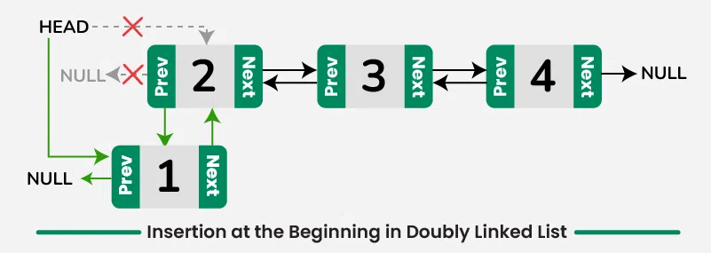
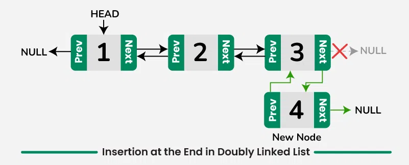

## Lesson: Doubly Linked List in C++ (Raw Pointers)

### **Introduction to Doubly Linked List**

A **doubly linked list** is a type of data structure that consists of nodes where each node contains:

1. **Data**: The value to be stored.
2. **Next Pointer**: A pointer to the next node in the list.
3. **Previous Pointer**: A pointer to the previous node in the list.

Unlike a **singly linked list**, where each node points to only the next node, the doubly linked list allows traversal
in both directions, making certain operations more efficient.

### **Basic Operations:

- Thinks about a LinkedList as a Lego Blocks and we link them together
- Insert a Node at the beginning of the list.
  

- Insert a Node at the end of the list
  

- Insert a Node at the specifix index
  

### **Doubly Linked List API (Public Interface)**

Here's the public interface (API) for the doubly linked list:

1. **Add Operations**:
    - `void push_front(T data)`: Insert a node at the front of the list.
    - `void push_back(T data)`: Insert a node at the back of the list.
    - `void insert_at(T data, int position)`: Insert a node at a specific position.

2. **Remove Operations**:
    - `void pop_front()`: Remove the node from the front of the list.
    - `void pop_back()`: Remove the node from the back of the list.
    - `void remove_at(int position)`: Remove the node at a specific position.

3. **Traversal and Access**:
    - `T front()`: Return the data of the front node.
    - `T back()`: Return the data of the back node.
    - `void display_forward()`: Display all the nodes starting from the head.
    - `void display_backward()`: Display all the nodes starting from the tail.

4. **Utility Functions**:
    - `bool empty()`: Check if the list is empty.
    - `int size()`: Return the number of nodes in the list.

#### **Use Cases of Doubly Linked Lists**

Doubly linked lists are suitable for use cases where:

1. **Bidirectional Traversal**: If you need to navigate in both directions, e.g., navigating through browser history or
   in multimedia applications (forward/backward).
2. **Efficient Insertion/Deletion**: If your application requires frequent insertions or deletions in the middle of a
   list, doubly linked lists are more efficient than arrays because they do not require shifting elements.

Some real-world use cases:

- Implementing undo-redo functionality.
- Navigating through pages in a web browser’s history.
- Data manipulation where frequent modification of internal nodes is required.

#### **Implementation of Doubly Linked List using Raw Pointers**

Here is the C++ implementation of a doubly linked list using raw pointers:

```cpp
#include <iostream>

template <typename T>
class Node {
public:
    T data;
    Node* prev;
    Node* next;

    Node(T value) : data(value), prev(nullptr), next(nullptr) {}
};

template <typename T>
class DoublyLinkedList {
private:
    Node<T>* head;
    Node<T>* tail;
    int node_count;

public:
    DoublyLinkedList() : head(nullptr), tail(nullptr), node_count(0) {}

    ~DoublyLinkedList() {
        while (head != nullptr) {
            Node<T>* temp = head;
            head = head->next;
            delete temp;
        }
    }

    // Insert at the front
    void push_front(T data) {
        Node<T>* new_node = new Node<T>(data);
        if (head == nullptr) {
            head = tail = new_node;
        } else {
            new_node->next = head;
            head->prev = new_node;
            head = new_node;
        }
        node_count++;
    }

    // Insert at the back
    void push_back(T data) {
        Node<T>* new_node = new Node<T>(data);
        if (tail == nullptr) {
            head = tail = new_node;
        } else {
            new_node->prev = tail;
            tail->next = new_node;
            tail = new_node;
        }
        node_count++;
    }

    // Remove from the front
    void pop_front() {
        if (head == nullptr) return; // Empty list
        Node<T>* temp = head;
        if (head == tail) { // Single node case
            head = tail = nullptr;
        } else {
            head = head->next;
            head->prev = nullptr;
        }
        delete temp;
        node_count--;
    }

    // Remove from the back
    void pop_back() {
        if (tail == nullptr) return; // Empty list
        Node<T>* temp = tail;
        if (head == tail) { // Single node case
            head = tail = nullptr;
        } else {
            tail = tail->prev;
            tail->next = nullptr;
        }
        delete temp;
        node_count--;
    }

    // Insert at specific position
    void insert_at(T data, int position) {
        if (position < 0 || position > node_count) {
            std::cerr << "Invalid position!\n";
            return;
        }
        if (position == 0) {
            push_front(data);
            return;
        }
        if (position == node_count) {
            push_back(data);
            return;
        }

        Node<T>* new_node = new Node<T>(data);
        Node<T>* current = head;
        for (int i = 0; i < position - 1; ++i) {
            current = current->next;
        }
        new_node->next = current->next;
        new_node->prev = current;
        current->next->prev = new_node;
        current->next = new_node;
        node_count++;
    }

    // Remove node at specific position
    void remove_at(int position) {
        if (position < 0 || position >= node_count) {
            std::cerr << "Invalid position!\n";
            return;
        }
        if (position == 0) {
            pop_front();
            return;
        }
        if (position == node_count - 1) {
            pop_back();
            return;
        }

        Node<T>* current = head;
        for (int i = 0; i < position; ++i) {
            current = current->next;
        }
        current->prev->next = current->next;
        current->next->prev = current->prev;
        delete current;
        node_count--;
    }

    // Display the list from head to tail
    void display_forward() {
        Node<T>* current = head;
        while (current != nullptr) {
            std::cout << current->data << " ";
            current = current->next;
        }
        std::cout << "\n";
    }

    // Display the list from tail to head
    void display_backward() {
        Node<T>* current = tail;
        while (current != nullptr) {
            std::cout << current->data << " ";
            current = current->prev;
        }
        std::cout << "\n";
    }

    // Return the number of nodes
    int size() {
        return node_count;
    }

    // Check if the list is empty
    bool empty() {
        return node_count == 0;
    }

    // Access the front node data
    T front() {
        if (head != nullptr)
            return head->data;
        throw std::runtime_error("List is empty");
    }

    // Access the back node data
    T back() {
        if (tail != nullptr)
            return tail->data;
        throw std::runtime_error("List is empty");
    }
};

int main() {
    DoublyLinkedList<int> dll;

    dll.push_back(10);
    dll.push_front(20);
    dll.push_back(30);
    dll.insert_at(25, 2);

    dll.display_forward();  // Output: 20 10 25 30
    dll.display_backward(); // Output: 30 25 10 20

    dll.pop_front();
    dll.pop_back();
    dll.display_forward();  // Output: 10 25

    dll.remove_at(1);
    dll.display_forward();  // Output: 10

    return 0;
}
```

### **Key Points**

1. **Memory Management**: Since this implementation uses raw pointers, manual memory management is required. Remember to
   handle `new` and `delete` carefully to avoid memory leaks.
2. **Traversal**: The doubly linked list allows bidirectional traversal using the `prev` and `next` pointers, which
   makes certain operations faster than with a singly linked list.
3. **Flexibility**: Operations such as insertion and deletion are O(1) when inserting/removing at the head or tail, and
   O(n) when accessing or modifying nodes in the middle.

### **Summary**

- **Doubly Linked List** allows both forward and backward traversal.
- This implementation uses raw pointers, requiring manual memory management.
- It provides various operations like insertion, deletion, and traversal that are efficient in certain scenarios, making
  it useful in various applications such as undo-redo systems and browsing history tracking.

This concludes the lesson on doubly linked lists using C++ raw pointers.