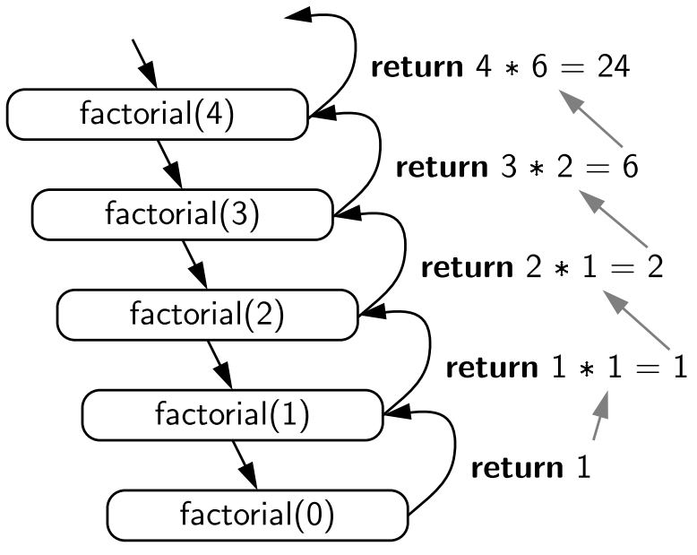
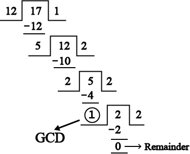
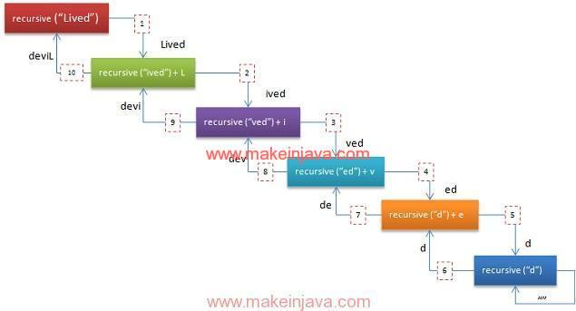
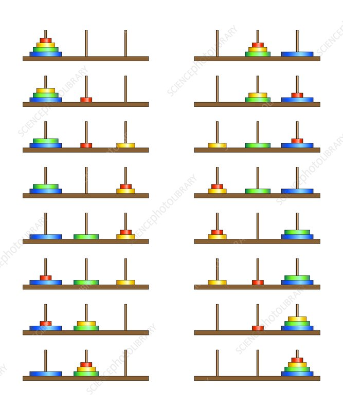

# Recursion

## Introduction

This C++ code demonstrates a variety of recursive algorithms, such as calculating the factorial of a number, generating
Fibonacci numbers, reversing a string, and solving the Tower of Hanoi puzzle. I'll break down each part of the code,
explaining its functionality, and provide diagrams where relevant.

## What is Recursion?

**Recursion** is a process in which a function calls itself in order to solve a problem. The key idea is that the
problem is divided into smaller, simpler instances of the same problem, and the function continues to call itself until
it reaches a base case, which is a condition that stops the recursion. Recursion is often used to solve problems that
have a repetitive or nested structure.

For example, consider the factorial of a number (n) (denoted n!):

n! = n*(n - 1)*(n - 2)*...* 1

A recursive function to calculate this would look like:

```cpp
int factorial(int n) {
    if (n <= 1) // base case
        return 1;
    return n * factorial(n - 1); // recursive case
}
```

**Key Elements of Recursion**:

1. **Base Case**: This is the condition where the recursion stops (e.g., \( n = 1 \)).
2. **Recursive Call**: The function calls itself with a modified argument, typically reducing the problem size (e.g., \(
   factorial(n - 1) \)).

## Resources:

- [Loop vs. Recursion](./LoopVSRecursion.md) (**`NO TEST`**)
- [Looping Strategies](./LoopStrategies.md)  (**`NO TEST`**)
- [For loop vs. While loop](./ForLoopVsWhiteloop.md)  (**`NO TEST`**)

## Use Cases:

### 1. **Factorial of a Number**

The `factorial` function computes the factorial of a number (n) (denoted n!):

n! = n*(n - 1)*(n - 2)*...* 1
The function calls itself recursively until it reaches the base case.



```cpp
// 1. Factorial of a Number
// Calculate the factorial of a number n (n!), which is the product of all positive integers less than or equal to n.
static int factorial(int n) {
    cout << n << ", " ;
    if (n <= 1) return 1; // base case
    return n * factorial(n - 1); // recursive case
}
```

**Example**: `factorial(5)`

```
5 * factorial(4)
  4 * factorial(3)
    3 * factorial(2)
      2 * factorial(1)
        1
= 120
```

**Diagram**:

```plaintext
factorial(5)
   |
factorial(4)
   |
factorial(3)
   |
factorial(2)
   |
factorial(1)
```

### 2. **Fibonacci Sequence**

The `fibonacci` function calculates the \( n \)-th number in the Fibonacci sequence. Each number is the sum of the two
preceding ones, and the sequence starts with 0 and 1.

```cpp
// 2. Fibonacci Sequence
// Find the nth number in the Fibonacci sequence, where each number is the sum of the two preceding ones.
static int fibonacci(int n) {
    cout << n << ", " ;
    if (n <= 1)
    {
        cout << endl;
        return n;
    }
    return fibonacci(n-1) + fibonacci(n-2); 
}
```

**Example**: `fibonacci(5)`

```
fibonacci(5) = fibonacci(4) + fibonacci(3)
fibonacci(4) = fibonacci(3) + fibonacci(2)
fibonacci(3) = fibonacci(2) + fibonacci(1)
fibonacci(2) = fibonacci(1) + fibonacci(0)
```

**Diagram**:

```plaintext
fibonacci(5)
  /    \
fib(4) fib(3)
 /  \    /  \
fib(3) fib(2) fib(2) fib(1)
...
```

### 3. **Sum of Natural Numbers**

The `sumOfNaturalNumbers` function calculates the sum of the first \( n \) natural numbers. It recursively adds numbers
until it reaches zero.

```cpp
// 3. Sum of Natural Numbers
// Calculate the sum of the first n natural numbers.
static int sumOfNaturalNumbers(int n) {
   cout << n << ", ";
   if (n == 0)
   {
      cout << endl;
      return 0; 
   } 
   return n + sumOfNaturalNumbers(n - 1);
}
```

**Example**: `sumOfNaturalNumbers(5)`

```
5 + sumOfNaturalNumbers(4)
  4 + sumOfNaturalNumbers(3)
    3 + sumOfNaturalNumbers(2)
      2 + sumOfNaturalNumbers(1)
        1 + sumOfNaturalNumbers(0)
= 15
```

### 4. **Power of a Number**

The `power` function calculates \( x \) raised to the power \( y \). It multiplies \( x \) by itself \( y \) times
recursively.

```cpp
    // 4. Power of a Number
    // Calculate x raised to the power y.
    static int power(int x, int y) {
        cout << "; x: " << x << " and y: " << y;
        if (y == 0) 
        {
            cout << endl;
            return 1;
        }
        return x * power(x, y - 1);
    }
```

**Example**: `power(2, 3)`

```
2 * power(2, 2)
  2 * power(2, 1)
    2 * power(2, 0)
      1
= 8
```

### 5. **Greatest Common Divisor (GCD)**

The `gcd` function calculates the greatest common divisor of two numbers using Euclid's algorithm. It recursively calls
itself with the remainder of the division between the two numbers until one of them becomes zero.



```cpp
// 5. Greatest Common Divisor (GCD)
// Find the GCD of two numbers using Euclid's algorithm
static int gcd(int a, int b) {
   cout << "a: " << a << ", b: " << b;
   if (b == 0) 
   {
      cout << endl;
      return a; 
   }
   return gcd(b, a % b);
}
```

**Example**: `gcd(48, 18)`

```
gcd(48, 18) = gcd(18, 48 % 18)
gcd(18, 12) = gcd(12, 18 % 12)
gcd(12, 6) = gcd(6, 12 % 6)
gcd(6, 0) = 6
```

**Diagram**:

```plaintext
gcd(48, 18)
   |
gcd(18, 12)
   |
gcd(12, 6)
   |
gcd(6, 0)
```

### 6. **Reverse a String**

The `reverseString` function reverses a given string recursively by swapping the first and last characters and calling
itself for the remaining substring.



```cpp
// 6. Reverse a String
// Reverse a given string s.
static void reverseString(string& s, int start, int end) {
   if (start >= end) return;
   swap(s[start], s[end]);
   reverseString(s, start + 1, end - 1);
}

```

**Example**: Reverse "hello"

```
swap('h', 'o')
swap('e', 'l')
swap complete
```

### 7. **Check Palindrome**

The `isPalindrome` function checks if a string is a palindrome (reads the same forwards and backwards) by recursively
comparing the first and last characters.

```cpp
// 7. Check Palindrome
// Check if a string s is a palindrome.
static bool isPalindrome(const string& s, int start, int end) {
   if (start >= end) return true;
   if (s[start] != s[end]) return false;
   return isPalindrome(s, start + 1, end - 1);
}
```

**Example**: Check "radar"

```
'r' == 'r'
'a' == 'a'
Complete. It is a palindrome.
```

### 8. **Tower of Hanoi**

The `towerOfHanoi` function solves the Tower of Hanoi puzzle. It moves \( n \) disks from the source rod to the
destination rod using an auxiliary rod, following the recursive steps.



```cpp

// 8. Tower of Hanoi
// Solve the Tower of Hanoi puzzle with n disks.
static void towerOfHanoi(int n, char from_rod, char to_rod, char aux_rod) {
   if (n == 0) return;
   towerOfHanoi(n-1, from_rod, aux_rod, to_rod);
   cout << "Move disk " << n << " from rod " << from_rod << " to rod " << to_rod << endl;
   towerOfHanoi(n-1, aux_rod, to_rod, from_rod);
}
```

**Example**: `towerOfHanoi(3)`

```
Move disk 1 from A to C
Move disk 2 from A to B
Move disk 1 from C to B
Move disk 3 from A to C
Move disk 1 from B to A
Move disk 2 from B to C
Move disk 1 from A to C
```

**Diagram**:

```plaintext
Move disk 1 from A to C
Move disk 2 from A to B
Move disk 1 from C to B
...
```

### 9. **Binary Search**

The `binarySearch` function performs binary search on a sorted array. It finds the middle element, compares it with the
target value, and recursively searches the left or right half of the array.

```cpp
// 9. Binary Search
// Perform binary search on a sorted array.
static int binarySearch(const vector<int>& arr, int l, int r, int x) {
   if (r >= l) {
      int mid = l + (r - l) / 2;
      if (arr[mid] == x) return mid;
      if (arr[mid] > x) return binarySearch(arr, l, mid - 1, x);
      return binarySearch(arr, mid + 1, r, x);
   }
   return -1;
}
```

**Example**: `binarySearch([1, 2, 3, 4, 5, 6, 7, 8, 9, 10], 7)`

```
Search in [1, 2, 3, 4, 5, 6, 7, 8, 9, 10], mid = 5
Search in [6, 7, 8, 9, 10], mid = 7
Found at index 6
```