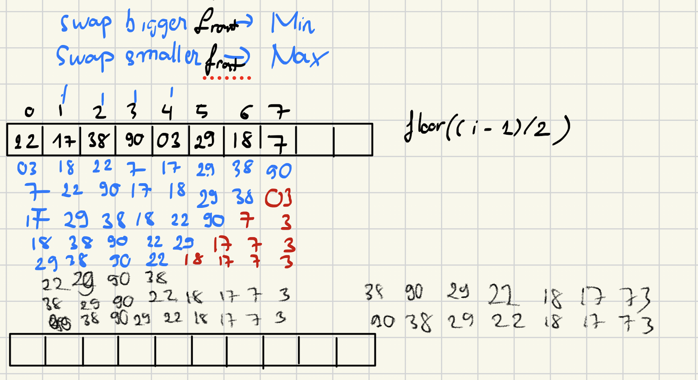

# Heap Sort

The `heapify` function is used to maintain the heap property in a binary tree. It plays a crucial role in building max-heaps and min-heaps, which are fundamental structures for algorithms like heap sort.

- [Heap Sort Algorithm](https://algostructure.com/sorting/heapsort.php)

### `heapify` Function
`heapify` ensures that a subtree with a given node as the root satisfies the heap property. If the subtree violates the heap property, the function rearranges the nodes so that the subtree becomes a valid max-heap or min-heap.

#### Step-by-Step Process to Build a Max-Heap

Given an array, `heapify` can be used to build a max-heap by ensuring that each parent node is greater than or equal to its children.

**Example Array**: `[3, 5, 1, 10, 2, 7]`

1. **Initial Array**: `[3, 5, 1, 10, 2, 7]`
2. **Start with the last non-leaf node** (index `n//2 - 1` where `n` is the number of elements).
3. Apply `heapify` on the subtree rooted at each non-leaf node from right to left.

**Heapify Steps**:
1. Start from index `2` (value `1`):
   - Compare with children `7` (at index `5`). `7` is larger.
   - Swap `1` and `7`. New array: `[3, 5, 7, 10, 2, 1]`

2. Move to index `1` (value `5`):
   - Compare with children `10` (at index `3`) and `2` (at index `4`). `10` is the largest.
   - Swap `5` and `10`. New array: `[3, 10, 7, 5, 2, 1]`

3. Move to index `0` (value `3`):
   - Compare with children `10` (at index `1`) and `7` (at index `2`). `10` is the largest.
   - Swap `3` and `10`. New array: `[10, 3, 7, 5, 2, 1]`
   - Apply `heapify` at index `1` again:
     - Compare `3` with children `5`. Swap `3` and `5`. Final max-heap array: `[10, 5, 7, 3, 2, 1]`

### Building a Min-Heap
For a min-heap, `heapify` ensures that each node is less than or equal to its children.

**Example Array**: `[3, 5, 1, 10, 2, 7]`

**Heapify Steps**:
1. Start from index `2` (value `1`):
   - Compare with children `7`. No changes needed as `1 < 7`.

2. Move to index `1` (value `5`):
   - Compare with children `10` and `2`. `2` is the smallest.
   - Swap `5` and `2`. New array: `[3, 2, 1, 10, 5, 7]`

3. Move to index `0` (value `3`):
   - Compare with children `2` and `1`. `1` is the smallest.
   - Swap `3` and `1`. New array: `[1, 2, 3, 10, 5, 7]`
   - Apply `heapify` at index `2` again. No changes needed as `3 < 7`.

**Final min-heap array**: `[1, 2, 3, 10, 5, 7]`

### Summary of `heapify` Steps:
1. Start at the last non-leaf node and apply `heapify` up to the root.
    - The parent node of child 'i' is equal to the lower bound of (i-1)/2
2. For each node, compare its value with its children.
3. If the heap property is violated, swap the node with the largest (max-heap) or smallest (min-heap) of its children.
4. Recursively apply `heapify` to the affected subtree.



### Visualizing the Max-Heap
Initial tree before heapifying:
```
      3
     / \
    5   1
   / \   \
  10  2   7
```

After building the max-heap:
```
     10
     / \
    5   7
   / \   \
  3   2   1
```

### Visualizing the Min-Heap
Initial tree before heapifying:
```
      3
     / \
    5   1
   / \   \
  10  2   7
```

After building the min-heap:
```
      1
     / \
    2   3
   / \   \
  10  5   7
```

x**Heap sort** is a comparison-based sorting algorithm that uses a binary heap data structure to sort an array. It sorts an array by leveraging the properties of a max-heap or min-heap. Here's a breakdown of what heap sort is and how it works:

### What is a Heap?
A **heap** is a specialized tree-based data structure that satisfies the heap property:
- **Max-Heap**: The value of each parent node is greater than or equal to the values of its children, meaning the largest value is at the root.
- **Min-Heap**: The value of each parent node is less than or equal to the values of its children, meaning the smallest value is at the root.

### How Does Heap Sort Work?
Heap sort uses a max-heap to sort an array in ascending order or a min-heap for descending order. It involves the following main steps:

1. **Build a Max-Heap** (for ascending order):
   - Transform the given array into a max-heap, where the largest element is at the root of the heap.
   
2. **Extract Elements**:
   - Swap the root (the largest element) with the last element in the array.
   - Reduce the size of the heap by one, effectively placing the largest element at the end of the array in its final sorted position.
   - Call the `heapify` function on the root to restore the max-heap property.
   - Repeat this process until the heap size is reduced to 1.

### Time and Space Complexity
- **Time Complexity**:
  - **Best Case**: \( O(n \log n) \)
  - **Average Case**: \( O(n \log n) \)
  - **Worst Case**: \( O(n \log n) \)
- **Space Complexity**: \( O(1) \) (in-place sorting)

### Properties of Heap Sort
- **In-Place**: Heap sort does not require additional storage; it sorts the array in-place.
- **Not Stable**: Heap sort is not a stable sort, meaning it does not preserve the relative order of equal elements.
- **Consistent Performance**: Unlike quicksort, which can degrade to \( O(n^2) \) in its worst case, heap sort has a guaranteed \( O(n \log n) \) time complexity regardless of input.

### When to Use Heap Sort
- **Memory-Constrained Environments**: Because of its \( O(1) \) space complexity, heap sort is suitable for situations where memory usage is a concern.
- **Guaranteed Performance**: Use heap sort when you need a sorting algorithm with consistent \( O(n \log n) \) time complexity for all inputs.

### How `heapify` is Used in Heap Sort
- **`heapify`** is a function that ensures the max-heap or min-heap property is maintained for a subtree. It is used during the initial heap building phase and after each swap during the extraction phase to keep the heap valid.

### Summary
**Heap sort** is an efficient sorting algorithm that organizes data into a heap and repeatedly extracts the maximum (or minimum) element to sort the data. It is in-place, has consistent performance, and works well for large datasets where space is limited.