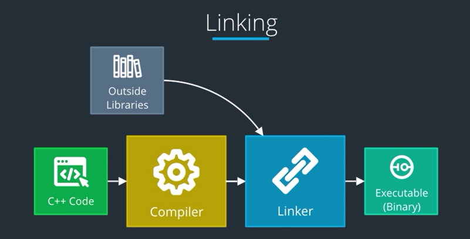
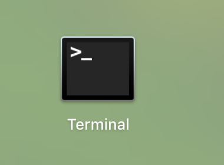

# Compilation and Execution in C++

## Object Files

When you compile a source code file (such as a `.cpp` file), it produces an **object file**. An object file contains
machine code but is not yet executable. It also includes important information like public APIs (symbols) and unresolved
references that need to be linked to other object files or libraries.

Object files can come from:

- Other source files within the same project.
- External or system libraries.

To make the object file executable, it needs to be linked with other object files or libraries.

## Linking

**Linking** is the process of combining object files to create a fully functional executable. During linking, symbolic
references between object files are resolved, and the result is a self-contained binary that includes all the machine
code needed to run the program.

### Dynamic Linking

In some cases, the executable does not include all the code. Instead, **dynamic linking** is used, where references to
libraries are resolved at runtime. This reduces file size but can introduce complications if the linked libraries change
unexpectedly, potentially causing bugs.

### Advantages of Dynamic Linking:

- Reduces the size of the executable.
- Libraries can be updated without recompiling the program.

### Disadvantages of Dynamic Linking:

- Changes in libraries can lead to unexpected behavior if a new version has breaking changes.



## Compiling with a Compiler

To convert C++ source code into an executable, you need a **compiler**. The compiler generates machine code specific to
your system's architecture. The **GNU Compiler Collection (GCC)**, commonly known as `g++` for C++, is a widely used
open-source compiler.

However, using `g++` directly can be cumbersome, especially for large projects. Here are two common challenges:

1. **Long command lines**: You need to provide paths for all source files, header files, and any necessary compiler
   flags, which can result in long and error-prone commands.
2. **Recompiling everything**: In large projects, if you modify just one source file, you typically only need to
   recompile that file. But using `g++` alone doesn’t track which files have changed, leading to unnecessary
   recompilation.

To address these challenges, tools like **Make** are often used to manage compilation efficiently by only recompiling
files that have changed.

---

## Step-by-Step: Compiling from the Terminal

The easiest and most direct method of compiling C++ programs is through the terminal. Follow these steps:

### Step 1: Open a Terminal Window

On Mac:

- Open the **Terminal** application from your applications folder.

On Windows:

- Open the **Command Prompt**.

Here's a screenshot of the terminal icon on macOS:



### Step 2: Verify the C++ Compiler is Installed

To check if `g++` is installed on your system, type:

```bash
g++ --help
```

If you see a list of options, `g++` is installed correctly. If not, you may need to install it or fix your system’s path
configuration.

### Step 3: Navigate to Your Project Directory

Use the following Unix or Windows commands to navigate to your project directory:

- `pwd`: Print the current working directory.
- `cd <directory>`: Change directory to `<directory>`.
- `ls`: List the contents of the directory (Unix).
- `dir`: List the contents of the directory (Windows).

Example:

```bash
cd path/to/your/program
```

Make sure your `.cpp` file is in this directory by listing the directory contents (`ls` or `dir`).

### Step 4: Compile the Program

To compile the program, use the following syntax:

```bash
g++ filename.cpp -o executableName
```

For example:

```bash
g++ assignment2.cpp -o assignment2
```

- `g++`: Invokes the compiler.
- `filename.cpp`: The source code file to compile.
- `-o executableName`: Specifies the name of the output executable.

### Step 5: Execute the Program

To run the compiled program, type:

```bash
./executableName
```

For example:

```bash
./assignment2
```

---

### Common Mistakes When Compiling:

1. **Spaces in filenames**: Avoid using spaces in filenames or directory names.
2. **File not found**: Ensure all required files (such as header files) are in the working directory. Use `ls` or `dir`
   to check.
3. **Missing C++ libraries**: If `g++` is not installed, you may need to install it via your system’s package manager (
   e.g., `brew` on macOS, `apt` on Ubuntu).