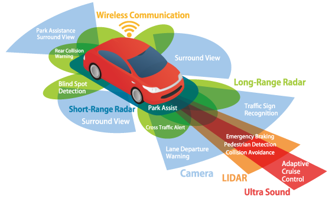

Here’s a refined version of your content on **Robotic Design and Development**:

---

# Robotic Design and Development

## Why C++? (Speed, Reliability, Security)

C++ is a popular choice for robotic development due to its unique combination of speed, reliability, and security. It is a powerful, high-level programming language that provides low-level access to hardware, making it ideal for robotic systems and embedded devices. Additionally, its extensive libraries and support make it a valuable tool for learning and implementing robotic programming.

### Key Reasons to Use C++ for Robotic Development:
- **Performance**: C++ is known for its speed and efficiency, which is crucial for real-time robotic operations.
- **Reliability**: C++ ensures stable and secure code execution, which is essential in robotics where precision and consistency are critical.
- **Hardware Access**: C++ allows direct interaction with hardware, giving developers fine control over robotic components.

## Why C++ is Ideal for Robotic Development:
- **Strong Foundations**: C++ offers fundamental programming concepts that are essential for understanding robotic programming.
- **High-Level and Generic Coding**: C++ supports high-level abstractions and generic programming, making it easier to develop scalable and reusable robotic code.
- **Educational Value**: It is an excellent language for learning programming concepts that are transferable to other areas of robotics and embedded systems.

## Where C++ is Used:
C++ is widely used in various industries that require fast and efficient interaction with hardware, including:
- **Networking**: Developing protocols and systems for high-speed communication.
- **Embedded Systems**: Programming microcontrollers and digital devices.
- **Animation and Gaming**: Creating complex simulations and real-time graphics.
- **Automotive Industry**: Powering software in cars, including autonomous vehicles.
- **Robotics**: Controlling robotic movements, sensors, and actuators.

## Why C++ Stands Out from Other Programming Languages:
- **Direct Hardware Interaction**: C++ allows developers to work closely with hardware components while maintaining a high level of efficiency.
- **Efficient Performance**: It bridges the gap between low-level hardware interaction and high-level software abstraction, offering both speed and ease of use.
- **Balance Between Low-Level and High-Level Features**: Developers don’t have to deal with the complexity of low-level programming all the time, yet can still achieve highly efficient, hardware-optimized solutions.

