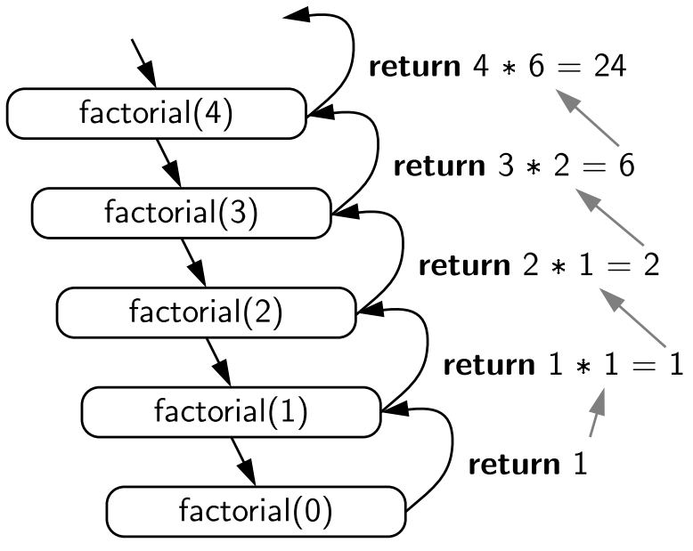
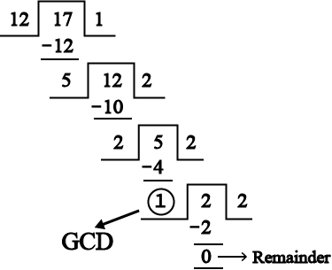
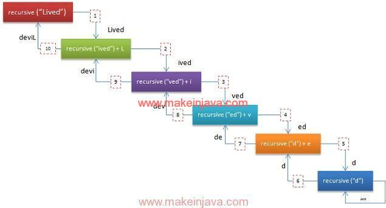

# Recursion

## Introduction
This C++ code demonstrates a variety of recursive algorithms, such as calculating the factorial of a number, generating Fibonacci numbers, reversing a string, and solving the Tower of Hanoi puzzle. I'll break down each part of the code, explaining its functionality, and provide diagrams where relevant.

## Recursion vs. loop
Let's break down the concepts of recursion and loops to clarify their differences.

### What is Recursion?

**Recursion** is a process in which a function calls itself in order to solve a problem. The key idea is that the problem is divided into smaller, simpler instances of the same problem, and the function continues to call itself until it reaches a base case, which is a condition that stops the recursion. Recursion is often used to solve problems that have a repetitive or nested structure.

For example, consider the factorial of a number \( n \) (denoted \( n! \)):

\[
n! = n \times (n - 1) \times (n - 2) \times \dots \times 1
\]
A recursive function to calculate this would look like:

```cpp
int factorial(int n) {
    if (n <= 1) // base case
        return 1;
    return n * factorial(n - 1); // recursive case
}
```

**Key Elements of Recursion**:
1. **Base Case**: This is the condition where the recursion stops (e.g., \( n = 1 \)).
2. **Recursive Call**: The function calls itself with a modified argument, typically reducing the problem size (e.g., \( factorial(n - 1) \)).

### What is a Loop (While Loop or For Loop)?

A **loop** is a control structure that repeatedly executes a block of code as long as a given condition is true. There are two common types of loops:

1. **For Loop**: Iterates a specific number of times, typically based on a counter.
   ```cpp
   for (int i = 1; i <= n; i++) {
       result *= i;
   }
   ```

2. **While Loop**: Repeats as long as a certain condition is true.
   ```cpp
   while (n > 0) {
       result *= n;
       n--;
   }
   ```

### Difference Between Recursion and Loops

| **Feature**         | **Recursion**                                   | **While Loop / For Loop**                        |
|---------------------|-------------------------------------------------|--------------------------------------------------|
| **Definition**       | Function that calls itself to solve a problem.  | Repeats a block of code until a condition is met. |
| **Termination**      | Terminates when a **base case** is reached.     | Terminates when the loop condition becomes false. |
| **Problem Structure**| Suited for problems that can be divided into smaller subproblems (e.g., tree traversal, factorial). | Suited for iterative problems where a known number of steps or a specific condition needs to be met. |
| **Memory Usage**     | Uses **stack memory** for each recursive call (may lead to stack overflow if recursion is too deep). | Uses less memory as it executes iteratively within the same function. |
| **Efficiency**       | Can be less efficient if recursion depth is large due to repeated function calls. | Generally more efficient for iterative tasks because there is no overhead from function calls. |
| **Examples**         | Factorial, Fibonacci, Tower of Hanoi, Tree Traversal. | Iterating through arrays, counting loops, processing lists. |

### Example: Factorial Using a Loop vs. Recursion

**Factorial Using Recursion**:
```cpp
int factorial(int n) {
    if (n <= 1) return 1; // base case
    return n * factorial(n - 1); // recursive call
}
```

**Factorial Using a Loop**:
```cpp
int factorial(int n) {
    int result = 1;
    for (int i = 1; i <= n; i++) {
        result *= i;
    }
    return result;
}
```

### Key Points:
- **Recursion** is elegant and can solve problems that are naturally recursive (like traversing tree structures or solving puzzles like Tower of Hanoi).
- **Loops** (for/while) are typically more efficient and preferred for simple iterative tasks (like iterating through arrays or summing numbers).

## Use Cases:

### 1. **Factorial of a Number**
The `factorial` function computes the factorial of a number \( n \), defined as:
\[
n! = n \times (n - 1) \times (n - 2) \times \dots \times 1
\]
The function calls itself recursively until it reaches the base case (i.e., \( n \leq 1 \)).



```cpp
// 1. Factorial of a Number
// Calculate the factorial of a number n (n!), which is the product of all positive integers less than or equal to n.
static int factorial(int n) {
    cout << n << ", " ;
    if (n <= 1) return 1; // base case
    return n * factorial(n - 1); // recursive case
}
```

**Example**: `factorial(5)`
```
5 * factorial(4)
  4 * factorial(3)
    3 * factorial(2)
      2 * factorial(1)
        1
= 120
```

**Diagram**:

```plaintext
factorial(5)
   |
factorial(4)
   |
factorial(3)
   |
factorial(2)
   |
factorial(1)
```

### 2. **Fibonacci Sequence**
The `fibonacci` function calculates the \( n \)-th number in the Fibonacci sequence. Each number is the sum of the two preceding ones, and the sequence starts with 0 and 1.

```cpp
// 2. Fibonacci Sequence
// Find the nth number in the Fibonacci sequence, where each number is the sum of the two preceding ones.
static int fibonacci(int n) {
    cout << n << ", " ;
    if (n <= 1)
    {
        cout << endl;
        return n;
    }
    return fibonacci(n-1) + fibonacci(n-2); 
}
```

**Example**: `fibonacci(5)`
```
fibonacci(5) = fibonacci(4) + fibonacci(3)
fibonacci(4) = fibonacci(3) + fibonacci(2)
fibonacci(3) = fibonacci(2) + fibonacci(1)
fibonacci(2) = fibonacci(1) + fibonacci(0)
```

**Diagram**:

```plaintext
fibonacci(5)
  /    \
fib(4) fib(3)
 /  \    /  \
fib(3) fib(2) fib(2) fib(1)
...
```

### 3. **Sum of Natural Numbers**
The `sumOfNaturalNumbers` function calculates the sum of the first \( n \) natural numbers. It recursively adds numbers until it reaches zero.

```cpp
// 3. Sum of Natural Numbers
// Calculate the sum of the first n natural numbers.
static int sumOfNaturalNumbers(int n) {
   cout << n << ", ";
   if (n == 0)
   {
      cout << endl;
      return 0; 
   } 
   return n + sumOfNaturalNumbers(n - 1);
}
```

**Example**: `sumOfNaturalNumbers(5)`
```
5 + sumOfNaturalNumbers(4)
  4 + sumOfNaturalNumbers(3)
    3 + sumOfNaturalNumbers(2)
      2 + sumOfNaturalNumbers(1)
        1 + sumOfNaturalNumbers(0)
= 15
```

### 4. **Power of a Number**
The `power` function calculates \( x \) raised to the power \( y \). It multiplies \( x \) by itself \( y \) times recursively.

```cpp
    // 4. Power of a Number
    // Calculate x raised to the power y.
    static int power(int x, int y) {
        cout << "; x: " << x << " and y: " << y;
        if (y == 0) 
        {
            cout << endl;
            return 1;
        }
        return x * power(x, y - 1);
    }
```

**Example**: `power(2, 3)`
```
2 * power(2, 2)
  2 * power(2, 1)
    2 * power(2, 0)
      1
= 8
```

### 5. **Greatest Common Divisor (GCD)**
The `gcd` function calculates the greatest common divisor of two numbers using Euclid's algorithm. It recursively calls itself with the remainder of the division between the two numbers until one of them becomes zero.



```cpp
// 5. Greatest Common Divisor (GCD)
// Find the GCD of two numbers using Euclid's algorithm
static int gcd(int a, int b) {
   cout << "a: " << a << ", b: " << b;
   if (b == 0) 
   {
      cout << endl;
      return a; 
   }
   return gcd(b, a % b);
}
```
**Example**: `gcd(48, 18)`
```
gcd(48, 18) = gcd(18, 48 % 18)
gcd(18, 12) = gcd(12, 18 % 12)
gcd(12, 6) = gcd(6, 12 % 6)
gcd(6, 0) = 6
```

**Diagram**:

```plaintext
gcd(48, 18)
   |
gcd(18, 12)
   |
gcd(12, 6)
   |
gcd(6, 0)
```

### 6. **Reverse a String**
The `reverseString` function reverses a given string recursively by swapping the first and last characters and calling itself for the remaining substring.



```cpp
// 6. Reverse a String
// Reverse a given string s.
static void reverseString(string& s, int start, int end) {
   if (start >= end) return;
   swap(s[start], s[end]);
   reverseString(s, start + 1, end - 1);
}

```
**Example**: Reverse "hello"
```
swap('h', 'o')
swap('e', 'l')
swap complete
```

### 7. **Check Palindrome**
The `isPalindrome` function checks if a string is a palindrome (reads the same forwards and backwards) by recursively comparing the first and last characters.

```cpp
// 7. Check Palindrome
// Check if a string s is a palindrome.
static bool isPalindrome(const string& s, int start, int end) {
   if (start >= end) return true;
   if (s[start] != s[end]) return false;
   return isPalindrome(s, start + 1, end - 1);
}
```

**Example**: Check "radar"
```
'r' == 'r'
'a' == 'a'
Complete. It is a palindrome.
```

### 8. **Tower of Hanoi**
The `towerOfHanoi` function solves the Tower of Hanoi puzzle. It moves \( n \) disks from the source rod to the destination rod using an auxiliary rod, following the recursive steps.


```cpp

// 8. Tower of Hanoi
// Solve the Tower of Hanoi puzzle with n disks.
static void towerOfHanoi(int n, char from_rod, char to_rod, char aux_rod) {
   if (n == 0) return;
   towerOfHanoi(n-1, from_rod, aux_rod, to_rod);
   cout << "Move disk " << n << " from rod " << from_rod << " to rod " << to_rod << endl;
   towerOfHanoi(n-1, aux_rod, to_rod, from_rod);
}
```

**Example**: `towerOfHanoi(3)`
```
Move disk 1 from A to C
Move disk 2 from A to B
Move disk 1 from C to B
Move disk 3 from A to C
Move disk 1 from B to A
Move disk 2 from B to C
Move disk 1 from A to C
```

**Diagram**:

```plaintext
Move disk 1 from A to C
Move disk 2 from A to B
Move disk 1 from C to B
...
```

### 9. **Binary Search**
The `binarySearch` function performs binary search on a sorted array. It finds the middle element, compares it with the target value, and recursively searches the left or right half of the array.
```cpp
// 9. Binary Search
// Perform binary search on a sorted array.
static int binarySearch(const vector<int>& arr, int l, int r, int x) {
   if (r >= l) {
      int mid = l + (r - l) / 2;
      if (arr[mid] == x) return mid;
      if (arr[mid] > x) return binarySearch(arr, l, mid - 1, x);
      return binarySearch(arr, mid + 1, r, x);
   }
   return -1;
}
```
**Example**: `binarySearch([1, 2, 3, 4, 5, 6, 7, 8, 9, 10], 7)`
```
Search in [1, 2, 3, 4, 5, 6, 7, 8, 9, 10], mid = 5
Search in [6, 7, 8, 9, 10], mid = 7
Found at index 6
```

## For loop vs. While loop (NO TEST)

Let’s dive into the differences between **for loops** and **while loops**, and then explore some use cases where each type of loop might be more appropriate.

### What is a **For Loop**?

A **for loop** is typically used when you know in advance how many times you want to repeat a block of code. It’s structured with three components: initialization, condition, and update (usually increment or decrement).

**Syntax**:
```cpp
for (initialization; condition; update) {
    // Code to be repeated
}
```

- **Initialization**: Happens only once, before the loop starts (e.g., setting up a counter).
- **Condition**: Checked before each iteration, and the loop runs as long as this is true.
- **Update**: Happens after each iteration, often incrementing or decrementing a counter.

**Example**:
```cpp
for (int i = 0; i < 5; i++) {
    cout << "Iteration " << i << endl;
}
```
This loop will execute 5 times, as `i` starts at 0 and increases by 1 after each iteration until `i` equals 5.

### What is a **While Loop**?

A **while loop** is used when you don’t know in advance how many times the loop will run. It repeats as long as a certain condition is true. This is more flexible but potentially riskier because it can lead to infinite loops if the condition never becomes false.

**Syntax**:
```cpp
while (condition) {
    // Code to be repeated
}
```

- **Condition**: Checked before every iteration. If the condition is false at the start, the loop will never run.
- The loop continues until the condition becomes false.

**Example**:
```cpp
int i = 0;
while (i < 5) {
    cout << "Iteration " << i << endl;
    i++; // Make sure the loop will eventually end
}
```
This loop will also execute 5 times, just like the for loop example, but the loop control (`i++`) is manually managed inside the loop.

### Key Differences Between **For** and **While** Loops:

| **For Loop**                                    | **While Loop**                                   |
|--------------------------------------------------|--------------------------------------------------|
| **Best for situations where you know in advance how many times the loop will run**. | **Best when you don't know how many iterations are needed beforehand**. |
| The loop control (initialization, condition, and update) is all in one line, making it more concise. | The loop control is usually spread out, giving more flexibility but sometimes making it less clear. |
| It’s cleaner for counting or iterating through elements (e.g., iterating over arrays or lists). | It’s more flexible for conditions that can change in unpredictable ways (e.g., waiting for user input or events). |
| Can be easier to read when iterating a fixed number of times. | Often used in cases where the number of iterations depends on runtime conditions. |
| **Risk of infinite loop is lower**, as the increment is built into the structure. | **Higher risk of infinite loops** if the condition isn't properly updated inside the loop. |

### Use Cases for **For Loop**:

1. **Iterating Over an Array or List**:
   A `for loop` is perfect for processing each element in a list, array, or range of numbers, especially when the number of iterations is fixed.
   
   **Example**:
   ```cpp
   int numbers[] = {1, 2, 3, 4, 5};
   for (int i = 0; i < 5; i++) {
       cout << numbers[i] << endl;
   }
   ```

2. **Running a Loop a Fixed Number of Times**:
   When you know exactly how many iterations you need, a `for loop` is ideal.
   
   **Example**:
   ```cpp
   for (int i = 0; i < 10; i++) {
       cout << "This will run 10 times" << endl;
   }
   ```

3. **Counting Loops**:
   Counting numbers from 1 to 100, where the number of iterations is known ahead of time.
   
   **Example**:
   ```cpp
   for (int i = 1; i <= 100; i++) {
       cout << i << " ";
   }
   ```

### Use Cases for **While Loop**:

1. **Waiting for User Input**:
   A `while loop` can be useful when you don’t know how many times you need to prompt the user for input until they give a valid response.
   
   **Example**:
   ```cpp
   int number;
   cout << "Enter a number between 1 and 10: ";
   cin >> number;
   while (number < 1 || number > 10) {
       cout << "Invalid! Enter a number between 1 and 10: ";
       cin >> number;
   }
   ```

2. **Running Until a Condition is Met**:
   `while loops` are great when you don’t know in advance how many iterations you’ll need, like waiting for a specific condition to occur.
   
   **Example**:
   ```cpp
   int i = 0;
   while (true) { // Infinite loop unless broken
       cout << "Enter a positive number (or -1 to stop): ";
       cin >> i;
       if (i == -1) break;
       cout << "You entered " << i << endl;
   }
   ```

3. **Processing a Stream of Data**:
   When reading data from a stream (like a file or network), the number of data elements may not be known, making a `while loop` appropriate.
   
   **Example**:
   ```cpp
   string line;
   while (getline(cin, line)) { // Keep reading until end of file/input
       cout << "You entered: " << line << endl;
   }
   ```

### Summary of Key Points:
- **For loops** are best when the number of iterations is known in advance, and they provide a concise structure for controlling the loop.
- **While loops** are more flexible and are used when the number of iterations depends on runtime conditions, like waiting for a specific input or event.

## Looping Strategies (NO TEST)

There are several types of looping strategies in programming. These loops allow for repetitive execution of code until a certain condition is met. Here are the main types of loops and looping strategies used in various programming languages:

### 1. **For Loop**
- **Description**: Used when you know the exact number of iterations in advance.
- **Structure**: Typically involves initialization, a condition, and an update step.
- **Use Case**: Iterating over arrays, collections, or executing code a fixed number of times.

**Example (C++):**
```cpp
for (int i = 0; i < 5; i++) {
    cout << i << endl;
}
```

### 2. **While Loop**
- **Description**: Used when you don't know in advance how many times the loop will execute, but you know a condition that needs to be satisfied for it to continue.
- **Structure**: Executes as long as a specified condition is true.
- **Use Case**: Waiting for user input or running code until a certain condition is met.

**Example (C++):**
```cpp
int i = 0;
while (i < 5) {
    cout << i << endl;
    i++;
}
```

### 3. **Do-While Loop**
- **Description**: Similar to the `while loop`, but it guarantees at least one execution because the condition is checked after the code block is executed.
- **Structure**: The loop runs once before checking the condition.
- **Use Case**: When the code needs to be executed at least once before checking the condition (e.g., validating user input).

**Example (C++):**
```cpp
int i = 0;
do {
    cout << i << endl;
    i++;
} while (i < 5);
```

### 4. **Enhanced For Loop (For-Each Loop)**
- **Description**: Used to iterate over elements in a collection or array without needing to manage the index explicitly.
- **Structure**: Simplified syntax for iterating over collections or arrays.
- **Use Case**: Traversing elements in an array or a list where you don't need to modify the loop variable.

**Example (C++ - Range-based for loop):**
```cpp
vector<int> numbers = {1, 2, 3, 4, 5};
for (int num : numbers) {
    cout << num << endl;
}
```

### 5. **Infinite Loop**
- **Description**: A loop that runs indefinitely unless manually interrupted, typically using a break statement or external conditions.
- **Structure**: Created when no termination condition is given or the condition is always true.
- **Use Case**: Used in event-driven systems or servers that wait for external input.

**Example (C++):**
```cpp
while (true) {
    cout << "This will print forever until you break." << endl;
    break; // Example of how to exit an infinite loop.
}
```

### 6. **Recursion (Indirect Looping)**
- **Description**: Recursion is not a loop in the traditional sense but a looping mechanism where a function calls itself to solve smaller subproblems.
- **Structure**: Involves a base case and a recursive call.
- **Use Case**: When a problem can be broken down into smaller subproblems (e.g., factorial, Fibonacci sequence, tree traversal).

**Example (C++):**
```cpp
int factorial(int n) {
    if (n == 0) return 1; // Base case
    return n * factorial(n - 1); // Recursive call
}
```

### 7. **Nested Loops**
- **Description**: A loop inside another loop. The inner loop runs fully for each iteration of the outer loop.
- **Structure**: You can nest any type of loop inside another (e.g., `for` inside `while`, `for` inside `for`, etc.).
- **Use Case**: Commonly used in matrix operations, 2D arrays, or solving problems involving multiple dimensions.

**Example (C++):**
```cpp
for (int i = 0; i < 3; i++) {
    for (int j = 0; j < 3; j++) {
        cout << "i: " << i << ", j: " << j << endl;
    }
}
```

### 8. **Break and Continue in Loops**
- **Break**: Used to terminate the loop before its natural end.
- **Continue**: Skips the current iteration and moves on to the next one.

**Break Example (C++):**
```cpp
for (int i = 0; i < 5; i++) {
    if (i == 3) break; // Exit loop when i is 3
    cout << i << endl;
}
```

**Continue Example (C++):**
```cpp
for (int i = 0; i < 5; i++) {
    if (i == 3) continue; // Skip iteration when i is 3
    cout << i << endl;
}
```

### Summary of Looping Strategies:

1. **For Loop**: Known number of iterations.
2. **While Loop**: Unknown number of iterations but based on a condition.
3. **Do-While Loop**: Executes at least once before checking the condition.
4. **Enhanced For Loop**: Iterating through collections or arrays.
5. **Infinite Loop**: Runs indefinitely until interrupted.
6. **Recursion**: Function-based looping for problems that can be broken down.
7. **Nested Loops**: Loop within another loop for handling multidimensional data.